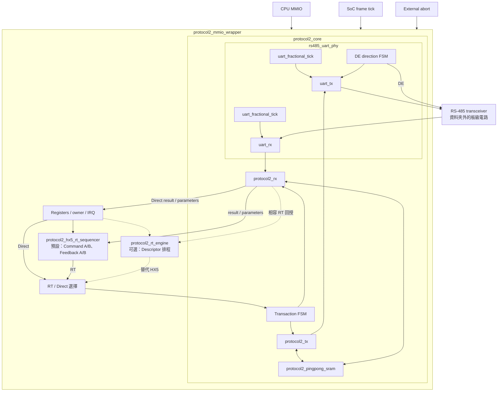
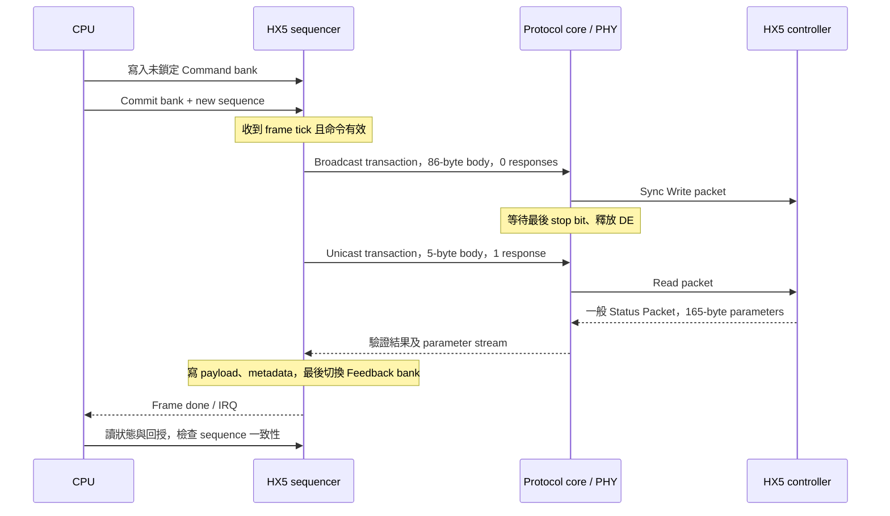

# DYNAMIXEL Protocol 2.0 的硬體化設計：協定行為、RTL 實作與系統限制

本文依 2026-09-22 工作目錄中的程式碼校訂，分析範圍為 `rtl/protocol/core/` 的 11 個 SystemVerilog 模組，並以 SoC 設定、頂層接線與韌體補充其使用情境。協定規則參照 ROBOTIS 官方文件；模組功能、容量與限制則以目前 RTL 為準。本文是設計分析及既有模擬結果整理，未包含實機量測或實體設計成果。

## 摘要

本設計將 DYNAMIXEL Protocol 2.0 通訊中的封包組裝、CRC、接收驗證及半雙工方向控制實作為硬體，並以固定排程器執行 HX5 手部控制器的週期通訊。CPU 負責產生控制內容及提交命令，硬體負責按照 frame trigger 發送命令與接收回授。系統利用分層狀態機及雙緩衝，處理 UART、封包、交易與控制週期之間不同的完成條件。

目前 SoC 預設使用 `protocol2_hx5_rt_sequencer`，執行一次廣播 Sync Write，再執行一次單播 Read。通用的 `protocol2_rt_engine` 保留為可選實作。預設通訊速率為 6 Mbps，週期觸發頻率為 1 kHz，但 communication deadline 與 command deadline 均預設關閉，因此不能將觸發頻率直接視為每筆通訊在 1 ms 內完成的保證。

## 一、DYNAMIXEL Protocol 2.0 的行為

### 1.1 通訊角色與基本交易

DYNAMIXEL 使用半雙工 UART 8-N-1 通訊。控制器送出 Instruction Packet，裝置依指令及 Status Return Level 回傳 Status Packet。一般 ID 範圍為 0–252，`0xFE` 為廣播。Ping、Read、Write 用於探測與暫存器存取；Sync Read／Write 用於多裝置相同地址與長度的存取；Bulk Read／Write 允許各裝置使用不同地址或長度。廣播 Sync Write 沒有逐裝置確認回覆。[ROBOTIS Protocol 2.0](https://emanual.robotis.com/docs/en/dxl/protocol2/)

對本設計而言，一筆 transaction 是「送出一個指令封包，並接收設定數量的狀態封包」；一個 RT frame 則可以包含數筆 transaction。預設 HX5 frame 包含兩筆 transaction，只有第二筆 Read 需要一個回應。這個分層使封包處理器不必理解位置、電流或觸覺資料的應用意義。

### 1.2 封包格式與長度

一般封包格式如下，Length 與 CRC 都先傳低位元組：

```text
Instruction:
FF FF FD | 00 | ID | LEN_L LEN_H | INST | PARAMETERS | CRC_L CRC_H

Status:
FF FF FD | 00 | ID | LEN_L LEN_H | 55   | ERROR | PARAMETERS | CRC_L CRC_H
```

Length 從 Instruction 起算至 CRC 結束；Status 多一個 Error byte。Error 的 bit 7 是 Alert，低 7 bits 為錯誤編號。[ROBOTIS 封包格式](https://emanual.robotis.com/docs/en/dxl/protocol2/#instruction-packet)

在這份 RTL 中，`cmd_body_len` 是未 stuffing 的 `Instruction + Parameters` 長度，不包含前方 7 bytes，也不包含 CRC。令指令參數數量為 N、插入的 stuffing 數量為 S，可以由 TX 的 `protocol_length = stuffed_length + 2` 與 header 產生器得到：

```text
Instruction body length = N + 1
Instruction Length      = N + 3 + S
Instruction wire bytes  = N + 10 + S

一般 Status Length      = N + 4 + S
一般 Status wire bytes  = N + 11 + S
```

例如 Read 的 body 為 `02 ADDR_L ADDR_H SIZE_L SIZE_H`，共 5 bytes；在沒有 stuffing 時，線上封包為 `7 + 5 + 2 = 14 bytes`。不能把「5-byte Read body」寫成「5-byte 完整封包」。實作依據：[protocol2_tx.sv](../rtl/protocol/core/protocol2_tx.sv)、[protocol2_rx.sv](../rtl/protocol/core/protocol2_rx.sv)。

### 1.3 Byte stuffing 與 CRC

為避免資料中的 `FF FF FD` 被誤認為 header，傳送端插入一個 `FD`，形成 `FF FF FD FD`，更新 Length 後再計算 CRC。接收端 CRC 必須涵蓋 stuffing bytes，驗證後才能把還原資料交給使用者。半雙工方向切換須等待實際傳送結束；官方規定指令封包的 byte 間隔不可超過 1.5 ms。[ROBOTIS 封包處理與時序](https://emanual.robotis.com/docs/en/dxl/protocol2/#packet-process)

## 二、移植到 RTL 時的軟硬體分工

將 Protocol 2.0 移植到 RTL，首先要決定控制流程中哪些工作留給軟體，哪些工作由硬體承接。軟體適合處理會隨應用變動的控制策略、任務排程及異常處置；硬體則適合處理重複的封包作業、資料傳遞與精確通訊時序。分工的目標，是讓 CPU 以完整命令與回授為單位管理控制循環，讓硬體持續完成底層傳輸。

| 面向 | 軟體層負責 | 硬體層負責 |
|---|---|---|
| 排程 | 決定控制任務、命令內容、更新頻率與提交時機 | 依設定的觸發與交易順序執行通訊 |
| 命令與封包 | 準備目標 ID、指令、地址、資料及回應需求 | 自動補齊封包欄位、stuffing、CRC 與串列傳送 |
| 監控 | 判讀回授、追蹤資料新鮮度與耗時，決定後續處置 | 偵測通訊異常，提供狀態、計數及完成通知 |
| 資料交換 | 提交完整命令、取用有效回授 | 以 handshake 與緩衝管理資料移交 |
| 效能 | 選擇可負擔的更新工作量，檢查整體時間預算 | 提供足夠的傳送、接收及記憶體處理能力 |

本章先說明設計時需要考慮的大方向；第三章再將這些責任對應到目前的模組、介面與實作方法。

### 2.1 軟體層：排程、資料準備與監控

#### 2.1.1 控制任務與命令排程

軟體需要決定每個控制週期要更新哪些目標、讀取哪些狀態，以及何時準備下一筆命令。若系統還有感測、推論、軌跡產生或其他任務，軟體必須安排其先後關係，使通訊硬體需要資料時，已有完整且有效的命令可以使用。

此處應區分「控制任務排程」與「線上交易執行」。控制任務排程決定本週期的控制內容與資料是否準時備妥；線上交易執行則決定何時發送已準備好的封包、等待多少回應及何時結束。前者由軟體管理，後者可交由硬體執行。在目前 HX5 設計中，CPU 準備命令，硬體收到 frame tick 後依固定順序執行 Sync Write 與 Read。

因此，即使通訊週期由硬體觸發，軟體仍須安排命令產生與提交的時間。若 CPU 延遲或沒有提供新命令，硬體需要有明確的處理方式；本設計會將缺少有效新命令的 frame 標記為 stale，具體流程於第三章說明。

#### 2.1.2 初始化與資料準備

軟體負責建立裝置與應用之間的資料約定，例如 ID、baud、操作模式、讀寫地址及欄位排列。控制數值也需由軟體轉成硬體介面所要求的命令資料；回授則由軟體解讀為位置、速度、電流或觸覺資訊。

自動打包的責任邊界必須清楚：目前 CPU 仍會準備 Instruction 與 Parameters，硬體才將其轉換成線上封包。硬體不會從「目標位置」自行推導裝置地址、操作模式或應用命令。因此，軟體必須先完成資料配置與整筆寫入，再通知硬體可以使用，避免傳送尚未寫完的命令。

#### 2.1.3 執行狀態與通訊品質監控

軟體需要持續監控三類資訊：交易是否完成、回授是否有效，以及控制循環是否符合時間要求。除了接收完成通知，也應檢查錯誤狀態、命令與回授序號、資料是否過期，以及通訊耗時是否逐漸接近預算。

硬體可以偵測 CRC、timeout 或接收溢位等事件，並提供狀態及計數；軟體則依事件對控制工作的影響，決定是否重新配置、重新提交命令、降低更新工作量或停止控制。這些屬於需要由軟體設計的管理策略，並不表示目前韌體已自動實作所有處置。

同樣地，硬體的 frame done 只表示本次處理已結束，不能單獨證明回授正確。軟體必須同時檢查結果與資料新鮮度，才能將回授用於後續控制。

### 2.2 硬體層：資料流、自動打包、吞吐量與記憶體

#### 2.2.1 Handshake：定義資料何時被接受

硬體模組的處理速度可能不同：CPU 可能暫時沒有命令、SRAM 可能等待讀取完成、UART 則以較慢的串列速率輸出。Handshake 的用途是讓相鄰模組確認「資料已備妥」與「接收端能接受」，使資料只在雙方同意時前進。

設計時要先定義傳輸單位、暫停時資料由誰保留，以及接收端忙碌時上游如何等待。命令被接受、封包送出及整筆交易完成，也需要分別通知，讓上層知道目前進度。至於 ready／valid 訊號與狀態機如何實現，留待第三章對照 RTL 說明。

#### 2.2.2 自動打包：承接重複的協定處理

硬體接收軟體提供的命令資料後，負責產生封包前綴與長度、執行 stuffing、計算 CRC，再交給 UART 發送。接收方向則搜尋及解析封包、驗證內容、還原參數，將結果交回上層。這使 CPU 能以交易為單位操作，減少逐 byte 管理 UART 與通訊方向的工作。

這一層的設計問題是輸入、輸出與錯誤的邊界：軟體提供到哪一個欄位、硬體自動補哪些欄位、是否需要先收齊 body，以及驗證失敗時如何通知。實作時再處理 Length、CRC 與 stuffing 的具體相依關係。

#### 2.2.3 吞吐量：確認整條資料路徑能支撐控制週期

吞吐量分析需要涵蓋一個控制週期的全部傳送量、回應量、封包額外開銷及等待時間。UART baud 決定線上的傳輸能力；內部打包、SRAM 存取與回授搬運，也必須提供足夠的供應及消化速度，才不會讓傳送中斷或讓接收資料堆積。

因此，需要同時評估「每秒能完成多少次資料交換」及「單次交換最久需要多久」。平均資料量足夠小，仍可能在 stuffing 增多、裝置回應變慢或內部資料流停頓時超出週期。硬體應提供完成時間及錯誤資訊，供軟體檢查整體排程是否可行。

特別是接收端，內部 handshake 無法要求遠端 UART 停止送資料，必須透過足夠的接收處理能力與緩衝承接突發流量。第四章再以目前 HX5 的封包大小，計算理論傳輸時間並討論 1 kHz 的限制。

#### 2.2.4 記憶體：安排容量、存取與資料所有權

記憶體設計需要回答三個問題：需要暫存多少資料、哪些模組會同時存取，以及何時可以覆寫舊資料。封包緩衝要容納長度變化與 stuffing；命令及回授緩衝則要協調 CPU 和通訊硬體的存取，避免讀到半筆新資料或覆寫尚未使用的內容。

雙緩衝是其中一種安排：一份供目前工作使用，另一份準備下一筆資料，完成後再交換角色。但仍須定義提交、鎖定、發布及回收的時機。若 CPU 讀取過慢，或新資料產生速度長期超過消費速度，有限的緩衝仍會耗盡，必須有可觀測的錯誤或丟棄規則。

選擇記憶體時也要一起評估容量、port 數量、存取頻寬與讀取延遲。這些條件會影響模組能否並行工作，以及前述吞吐量能否達成；第三章再說明目前 SRAM 仲裁及 command／feedback bank 的實作。

### 2.3 軟硬體交界：建立可監控的控制循環

完整的控制循環可整理為：

```text
軟體排程與產生命令 → 提交完整資料 → 硬體打包與執行通訊
        ↑                                  ↓
依結果安排下一週期 ← 監控狀態與解讀回授 ← 驗證並發布結果
```

雙方必須共同約定命令何時生效、回授何時可讀、逾時及錯誤如何呈現，以及異常後由誰決定恢復方式。軟體據此監控與排程，硬體據此執行與回報，才能把個別模組組成可持續運作的控制循環。

接下來先介紹資料夾的模組架構與一次 HX5 交易流程，再於第 3.5 節將上述大方向套用到實際 RTL，包括 handshake、封包建立、UART、SRAM、雙緩衝與 timeout 的細節。

## 三、資料夾架構及資料流

### 3.1 檔案與責任分工

```text
rtl/protocol/
└── core/
    ├── README.md
    ├── protocol2_mmio_wrapper.sv
    ├── protocol2_hx5_rt_sequencer.sv
    ├── protocol2_rt_engine.sv
    ├── protocol2_core.sv
    ├── protocol2_tx.sv
    ├── protocol2_rx.sv
    ├── protocol2_pingpong_sram.sv
    ├── rs485_uart_phy.sv
    ├── uart_tx.sv
    ├── uart_rx.sv
    └── uart_fractional_tick.sv
```

| 模組 | 主要責任 | 所處邊界 |
|---|---|---|
| `protocol2_mmio_wrapper` | MMIO、owner 切換、baud 設定、IRQ、間接記憶體存取、abort | CPU／SoC 與通訊子系統 |
| `protocol2_hx5_rt_sequencer` | 固定兩筆交易、command／feedback banks、commit、stale 與 deadline | 預設 RT frame 控制 |
| `protocol2_rt_engine` | Descriptor 排程、period divider、budget 驗證及多裝置回授配置 | 可選相容 RT frame 控制 |
| `protocol2_core` | TX／RX 交易協調、預期回應數與交易結束判定 | 一筆 transaction |
| `protocol2_tx` | Stuffing、Length、header、CRC 與 body SRAM 預取 | 命令 body → wire bytes |
| `protocol2_rx` | Header 搜尋、CRC／格式／ID 驗證、去 stuffing、timeout | wire bytes → 結果及參數 |
| `protocol2_pingpong_sram` | 2 KB 封包記憶體及 macro port 仲裁 | TX／RX 共用儲存 |
| `rs485_uart_phy` | UART 串接、DE 方向控制、自發送期間 RX 屏蔽 | byte stream 與實體腳位 |
| `uart_tx` | 8-N-1 串列化、byte／packet 實際傳送完成 | byte → bit |
| `uart_rx` | 輸入同步、取樣、framing／overrun 偵測 | bit → byte |
| `uart_fractional_tick` | 依 runtime tick_hz 產生分數頻率 clock enable | UART 位元與取樣計時 |

### 3.2 實際例化關係



圖中虛線表示可選替代路徑。HX5 sequencer 與 generic engine 由 generate 選擇其一，不會在預設設計中並列工作。`rs485_uart_phy` 是 `protocol2_core` 的子模組；兩個 UART 各自例化 fractional tick。

SoC 預設 `CPU_OWNS_PROTOCOL_COMMANDS=1`、`USE_HX5_RT_SEQUENCER=1`，且將 wrapper 的 `USE_EXTERNAL_FRAME_TICK` 設為 1。故預設 frame 觸發來自 SoC 共用 tick，不能只改 wrapper 的 `FRAME_PERIOD` 就認為已改變外部 tick 的頻率。Pose-to-Protocol 硬體 adapter 位於本資料夾之外，僅於相容設定啟用。[soc_core_top.sv](../rtl/top/soc_core_top.sv)

### 3.3 一次 HX5 控制循環

以下內容由本專案韌體的封包建立函式推導；地址、欄位及資料意義依該韌體約定，裝置端必須有相符映射。



**Command bank：**

| Byte offset | 內容 | 長度 |
|---|---|---:|
| 0 | Sync Write instruction `0x83` | 1 B |
| 1–2 | 寫入起始地址 799，即 `1F 03` | 2 B |
| 3–4 | 每個目標控制器資料長度 80，即 `50 00` | 2 B |
| 5 | 控制器 ID，韌體預設 110，即 `6E` | 1 B |
| 6–85 | 20 軸 × 每軸 4 bytes，位置與電流命令 | 80 B |
| 86–87 | 對齊空間，不送上線 | 2 B |
| 88–92 | Read body：`02 7A 02 A5 00`，從地址 634 讀 165 bytes | 5 B |

第一筆的外層 packet ID 是 `0xFE`，內部 Sync Write 參數中的裝置 ID 才是 110。這裡是「一個 HX5 控制器承載 20 軸資料」，不是向 20 個外部 UART ID 各送一包。

**Feedback bank：** 前 56 bytes 為 metadata；offset 56 起為 165-byte payload，由 20 軸 × 6 bytes 的馬達資料與 5 指 × 9 bytes 的觸覺資料組成。CPU helper 將每軸六個 byte 解讀為 current、velocity、position 各 16 bits，RTL 本身僅搬運 bytes。有效資料範圍到 offset 220，韌體以 224 bytes 對齊讀取，實體 bank 容量為 256 bytes。[hx5_d20_protocol.h](../fw/include/hx5_d20_protocol.h)

### 3.4 MMIO 控制面與操作順序

SoC 將 Protocol MMIO 配置於 `0x1003_0000`。主要介面如下：

| Offset | 功能 |
|---|---|
| `0x00–0x34` | Direct command、TX／RX 資料、結果與 IRQ |
| `0x40–0x50` | RT enable／status、frame period、兩種 deadline |
| `0x68–0x8C` | Masks、sequence、耗時、IRQ、abort 與 error count |
| `0x90–0x98` | Protocol owner 與 baud 選擇 |
| `0xB8 / 0xBC` | RT_MEM_ADDR／RT_MEM_DATA 間接記憶體窗口 |
| `0xC0 / 0xC4 / 0xC8` | Command commit、profile count、command sequence |
| `0xCC–0xD8` | Stale／commanded mask 與排程狀態 |

操作流程為：停止 RT 並確認閒置、選擇 owner／baud、設定 profile 與 timeout、寫入完整 command bank、設定 sequence 並 commit，最後啟用 RT。之後 CPU 持續提交新命令並讀取完整回授。`hx5_rt_control.h` 提供 CPU-owned 路徑的初始化及提交 helper。

Owner 0 是 RT、1 是 Direct；reset 後 wrapper 的 owner 是 Direct，RT 須由韌體切換啟用。Owner 2 的 Raw UART 介面僅保留，現有 wrapper 會拒絕選入。baud 選擇為 4、4.5、6 Mbps，切換必須滿足 RT 停用、transaction 與結果清空、DE 釋放等條件。

MMIO 必須遵守 byte write strobes。例如 command commit 要求低 byte 與最高 byte strobe 同時有效，且 `wdata[31]=1`。Direct `TX_DATA` 每次 MMIO 寫入只送一個被選取的 byte，即使四個 strobes 都有效也不是一次送四個 byte；RT memory data 才是 word 存取。[protocol2_mmio_wrapper.sv](../rtl/protocol/core/protocol2_mmio_wrapper.sv)

### 3.5 將軟硬體分工套用到目前 RTL

第二章先建立軟體管理控制工作、硬體承接通訊資料流的分工。本節在前述模組及 HX5 流程的基礎上，進一步說明硬體如何履行介面與時序要求，以及軟體如何透過提交及監控配合。以下訊號、狀態與數值皆對應目前程式碼。

#### 3.5.1 將軟體流程拆成有明確邊界的狀態機

軟體通常依序執行封包建立、寫入 UART、等待回應及解析結果；硬體必須將每一步轉換為可暫停、可恢復的狀態。此處可以區分四種資料單位：UART bit、packet byte、transaction，以及 RT frame。

| 層級 | 完成條件 | 對應模組 |
|---|---|---|
| UART byte | 最後一個 stop bit 的時間已結束 | `uart_tx` |
| TX packet | 最後 CRC byte 已交給 PHY；此時仍可能在串列化 | `protocol2_tx` |
| Transaction | PHY 已釋放方向；若需回應，所有指定結果及參數已處理 | `protocol2_core` |
| RT frame | 兩筆 transaction 完成或出錯，回授 metadata 寫完並切換 bank | `protocol2_hx5_rt_sequencer` |

因此，`tx_valid && tx_ready && tx_last` 只表示最後一個 byte 被 UART 接收，不能當成整個 packet 已離開輸出腳位。`protocol2_core` 使用 PHY 的 `tx_complete` 及 `direction_idle` 判斷何時進入接收階段。

#### 3.5.2 Ready／valid 必須代表真正的資料移交

命令、body、結果及 parameter 都使用 ready／valid 介面；只有兩者同時為 1 的 clock edge 才完成傳輸。下游暫停時，上游需保留 valid 與資料，計數器和 CRC 不可重複前進。

TX 的 `body_index` 依 `body_valid && body_ready` 增加，輸出 CRC 依 `tx_valid && tx_ready` 更新。插入 stuffing byte 時，狀態機停在 `INSERT_STUFF`，暫停接收下一筆原始 body。這是將軟體「插入一個 byte」轉換為硬體額外傳輸週期的具體方式。

內部 backpressure 只能暫停內部資料流，不能要求遠端 UART 停止傳送。`uart_rx` 只有一個完成 byte 的輸出暫存槽，若新 byte 到達時舊 byte 尚未取走，便回報 overrun。封包 SRAM 與雙緩衝可降低壅塞，但不是無限容量的 UART FIFO。

#### 3.5.3 變動長度需要儲存空間與上限檢查

由於 stuffed Length 取決於內容，TX 採取兩階段處理：

```text
LOAD_BODY / INSERT_STUFF
    ↓ 得到 stuffed_length
SEND_HEADER → BODY_READ / SEND_BODY → SEND_CRC
```

SRAM 儲存的是 stuffed body；前方 header 與最後 CRC 在輸出時產生，並非整包都預先存入 SRAM。body 輸出以 32-bit word 讀取，再拆成四個 byte；`current_word` 與 `next_word` 預取用來減少 SRAM 讀取等待造成的傳送間隙。

`protocol2_tx` 在接受命令前還會檢查以下保守上界：

```text
worst_case_stuffed_length = B + floor((B + 4) / 3)
```

其中 B 為原始 body 長度。預設 B 最大為 760，stuffed body 上限為 1015。這是設計的容量政策，並非 Protocol 2.0 的通用封包上限；即使內容完全不需 stuffing，超過設定的 body 長度仍會被拒絕。

TX 的 stuffing 邊界另有 SDK 相容條件：只有 `body_length >= 6` 且 `body_index >= 3` 才檢查 marker。這對應官方 C++ `addStuffing()` 的短封包提前返回及掃描起點，報告不應將其描述成對 header、CRC 或所有任意短 byte stream 全域替換。[官方 SDK 實作](https://raw.githubusercontent.com/ROBOTIS-GIT/DynamixelSDK/master/c%2B%2B/src/dynamixel_sdk/protocol2_packet_handler.cpp)

#### 3.5.4 CRC 的位元方向及更新時機

本設計的 TX 因此先接收及儲存 stuffed body，再送出已知 Length 的 header。RX 則採「線上資料計算 CRC，同步將去 stuffing 資料暫存」的方法，直到檢查完成才發布結果。雖然內部已提早還原資料，錯誤封包的 parameter length 仍設為零，不會以成功 payload 的形式輸出。

TX 與 RX 的 `crc16_update()` 使用 `16'h8005`，初值為零，逐 byte 以 MSB-first 位元運算更新；傳送 CRC 時則先輸出低 byte。計算涵蓋 header、ID、Length 與 stuffed body，不包含 CRC 欄位本身。

函式內的 8 次 `for` 迴圈描述固定組合邏輯，不表示硬體會花 8 個 clock 才處理一個 byte。這種寫法容易和參考演算法比對，但高頻率實體設計仍需檢查組合路徑延遲。RX 完成 CRC、Status instruction、ID 及長度檢查後，才讓 output FSM 發布 metadata 與參數。實作依據：[TX](../rtl/protocol/core/protocol2_tx.sv)、[RX](../rtl/protocol/core/protocol2_rx.sv)。

#### 3.5.5 UART 時序、同步器及 RS-485 方向控制

預設 CPU clock 為 100 MHz，外部通訊為 6 Mbps，RX oversample 為 16。因為 100 MHz 不是 6 MHz 或 96 MHz 的整數倍，`uart_fractional_tick` 使用 phase accumulator 產生時脈使能：每個系統週期累加目標 tick 頻率，超過 CLOCK_HZ 時輸出 tick 並扣除 CLOCK_HZ。

它不建立新的 clock domain，而是在原本的 `clk` 下產生 tick。相鄰 tick 可能相隔不同數量的系統週期，分析時必須保留這種量化誤差；UART TX 又會在每個 byte 開始時 restart 累加器，因此理想 baud 計算不能取代實際 byte 時序量測。

`uart_rx` 先經過兩級暫存同步，再偵測下降緣；等待半個 bit 確認 start bit，之後在每個 bit 的取樣位置讀取資料。此實作是 16 倍計時配合單點取樣，沒有多數決濾波。tick 產生器每個 clock 最多輸出一次 tick，故所選 clock／baud／oversample 必須滿足所需取樣速率不高於系統 clock；目前 `6 MHz × 16 = 96 MHz < 100 MHz`。

PHY 的方向狀態依序為：

```text
DIR_IDLE → DIR_SETUP → DIR_SEND → DIR_DRAIN → [DIR_GUARD] → DIR_IDLE
DE = 0      DE = 1      DE = 1      DE = 1        DE = 0        DE = 0
```

預設 DE setup 為 2 個 clock，post-TX guard 為零。`DIR_DRAIN` 等待 UART 真正完成最後一個 stop bit，之後才釋放 DE；guard 若開啟，是釋放 DE 後的等待。傳送期間，PHY 將 RX 輸入視為 idle high，避免把自身發送內容當成回應。外接收發器的 enable delay、線路延遲及對端回應時間仍需板級驗證。[UART 與 PHY 原始碼](../rtl/protocol/core/rs485_uart_phy.sv)

#### 3.5.6 SRAM 讀取延遲與 port 仲裁

`protocol2_pingpong_sram` 提供 512 × 32 bits，共 2048 bytes；byte address bit 10 選擇兩個 1024-byte bank。Port A 供 TX body 存取或 RX parser 寫入，Port B 供已完成 RX payload 讀出。

一般 RTL array 分支提供兩組邏輯存取；啟用 `RTOS_CORE_PROTOCOL2_USE_SRAM_MACRO` 時，底層改為單埠 macro，Port A 優先，Port B 必須等待 `ready`。因此讀取必須區分 request 被接受與 `read_valid` 返回，不可假設兩個 port 永遠同時完成。

記憶體內容不會在 reset／flush 時整塊清零；有效性由 valid、bank-full、長度與 metadata 管理。移植 ASIC SRAM 或 FPGA BRAM 時，必須核對 port 數量、byte mask 極性、read latency 及同址讀寫行為，不能僅以相同容量認定可以直接替換。[protocol2_pingpong_sram.sv](../rtl/protocol/core/protocol2_pingpong_sram.sv)

#### 3.5.7 雙緩衝與原子提交

本設計有兩種不同用途的雙緩衝。packet SRAM 處理 RX 收包與已完成 payload 的輸出重疊；RT command／feedback bank 則處理 CPU 與排程器之間的 frame 資料一致性，兩者不能混為一談。

CPU 在未鎖定的 command bank 寫好完整 body，再提交 bank 與 sequence。排程器於 frame 開始採用已提交的 bank，鎖定執行中及已提交的命令，避免 CPU 在 TX 讀取過程中改寫內容。若沒有有效 commit，或 sequence 與上一筆相同，HX5 sequencer 會產生 stale frame，跳過兩筆線上交易。即使目標值不變，CPU 若要維持週期發送，仍須提交新 sequence。

回授寫入另一個 working bank，先放 payload，再逐 word 寫入 14 words、共 56 bytes 的 metadata。最後才更新 `active_feedback_bank`。metadata 包含 frame／command sequence、起訖 timestamp、device masks、狀態、耗時與 slack；offset 0 與 52 另存相同的 frame sequence，供 CPU 檢查讀取一致性。

回授 bank 的發布不等於資料必定有效：失敗 frame 也會發布狀態，payload 可能保留舊值或部分資料。CPU 必須檢查狀態、sequence 與 bank，而不能只因 bank 改變就採用 payload。雙緩衝也沒有 CPU 長時間持有快照的鎖定功能，軟體仍需及時讀取或重試。[HX5 sequencer](../rtl/protocol/core/protocol2_hx5_rt_sequencer.sv)、[CPU 解碼函式](../fw/include/hx5_d20_protocol.h)

#### 3.5.8 Timeout、deadline 與中止必須分開定義

| 機制 | 目前 RTL 的語意 |
|---|---|
| Response timeout | RX start 後至封包接收驗證完成的絕對時間上限；雜訊 byte 不延長此時間 |
| Inter-byte timeout | 找到完整 header 後，控制欄位及 payload 的連續等待上限；接受 byte 後重置 |
| Communication deadline | RT frame 執行中的通訊時間限制；非零時才啟用 |
| Command deadline | 本週期內命令提交的時間窗口；非零時才啟用 |
| Abort／flush | 軟體或外部 abort 清除 core／packet／UART 的進行中狀態 |

預設 HX5 韌體設定 response timeout 為 60000 cycles，inter-byte timeout 為 1000 cycles；在 100 MHz 下分別是 600 μs 與 10 μs。這些是主站的實作設定，不是官方 1.5 ms 指令 byte 間隔規則的同義名稱。

`result_code` 表示本地解析或通訊結果，`dynamixel_error` 則是裝置回報的 Error。兩者分開保存；因此 CRC 正確仍可能收到非零 device error。HX5 層要求 result 成功、ID 正確、device error 為零且參數長度恰為 165，才接受該回應。

`rst` 是非同步外部 reset；`flush` 僅在 clock edge 被處理。Flush 不會撤銷已經送到裝置的 Write，也不代表已讓馬達停止；停止動作的策略與系統外部安全控制不屬於封包 parser 的功能。實作依據：[RX](../rtl/protocol/core/protocol2_rx.sv)、[MMIO wrapper](../rtl/protocol/core/protocol2_mmio_wrapper.sv)、[HX5 韌體常數](../fw/include/hx5_d20_protocol.h)。

## 四、目前實作的限制與效能邊界

### 4.1 預設為固定 profile，不具通用排程彈性

HX5 sequencer 的 transaction 長度、body offset、payload offset 及回授長度由 elaboration parameters 決定，不能透過任意 descriptor 在 runtime 改寫。它保留 80-byte profile window，但實際僅儲存 word 10、15、16：Read control、response timeout、inter-byte timeout。`descriptor_count` 必須為 2。

此設計減少 descriptor RAM、遍歷控制及 budget 算術，但 CPU 必須保證 body 內容正確。排程器不會檢查 body 第一 byte 是否真為 `0x83`／`0x02`，也不會核對 Sync Write 內部 ID 是否與 Read control 的 ID 相同。

### 4.2 容量及相容模式限制

| 項目 | 目前預設／限制 |
|---|---|
| Direct 未 stuffing body | 最多 760 B，包含 Instruction |
| Stuffed body | 最多 1015 B |
| 一般 RX parameters | 最多 1013 B；若 stuffing 增加後超過 wire body 上限，仍會拒收 |
| Packet SRAM | 2 × 1024 B |
| RT Command bank | 2 × 256 B |
| RT Feedback bank | 2 × 256 B |
| HX5 Read 回應 | 固定 1 包、165 B parameters |
| HX5 device mask | bit 0 代表整隻手；不是 20 軸各一個 bit |
| Generic descriptor RAM | 256 words，每 descriptor 10 words，最多 25 筆 |
| Generic 多裝置 mask | 多 ID 模式映射 ID 1–32；另有單 ID 回應路徑，不能說全部模式只支援 ID 1–32 |
| Wrapper baud | 4、4.5、6 Mbps；沒有任意 baud 的 MMIO 數值介面 |

容量參考 [rtos_core_config.svh](../rtl/include/rtos_core_config.svh)、[asl_soc_config.svh](../rtl/include/asl_soc_config.svh)；通用模式參考 [protocol2_rt_engine.sv](../rtl/protocol/core/protocol2_rt_engine.sv)。提高 parameter 數值之前，仍須核對地址寬度、bank 幾何及 SRAM 上限。

Direct TX 可由 CPU 組成不同 instruction body，但共用 RX 是一般 Status Packet parser；不能僅因能送出 opcode，就宣稱已支援 Fast Sync Read／Fast Bulk Read 的所有特殊回應格式。預設 HX5 路徑使用一般 Read，現有測試也不是 Fast 系列相容性證明。

### 4.3 1 kHz 觸發不等於 1 kHz 成功交換

依目前 HX5 body 大小，不含 stuffing 的線上資料量為：

| 封包 | 推導 | Wire bytes |
|---|---|---:|
| Sync Write | 7-byte 前綴 + 86-byte body + 2-byte CRC | 95 |
| Read | 7 + 5 + 2 | 14 |
| Status | 7 + 1 instruction + 1 error + 165 parameters + 2 CRC | 176 |
| 合計 | 三包相加 | **285** |

以本地 UART 的每 byte 10 bits 格式計算，理想線上時間如下：

| Baud rate | `285 × 10 / baud` | 距 1 ms 的理想剩餘時間 |
|---|---:|---:|
| 4 Mbps | 712.5 μs | 287.5 μs |
| 4.5 Mbps | 633.3 μs | 366.7 μs |
| 6 Mbps | 475.0 μs | 525.0 μs |

以上是依封包格式推導的基準值，未包含 stuffing、逐 byte 量化與間隙、body 準備、DE 切換、裝置處理延遲、SRAM 存取及 metadata commit。若三包合計插入 S bytes，單是線上序列化時間就變為 `(285 + S) × 10 / baud`。因此表中的剩餘時間不是實測 slack，也不是 deadline 可直接設定的最大值。

預設 `COMM_DEADLINE=0`、`COMMAND_DEADLINE=0`，只保留各回應 timeout 等檢查。HX5 sequencer 的 `schedule_budget_cycles` 與 `schedule_overflow` 固定輸出零；`schedule_valid` 只代表 profile 欄位符合條件，不能解讀成硬體已驗證通訊預算。

一般 enable 模式下，frame trigger 只在 `RT_WAIT_FRAME` 啟動新 frame；執行中到達的週期 tick 沒有 FIFO 排隊補送。超過一個週期可能跳過觸發，CPU 未提交新 sequence 則可能產生 stale frame。要主張每毫秒成功交換一次，仍須驗證最差 stuffing、裝置延遲、CPU 提交時間與所有內部開銷。

目前 `last_frame_cycles` 在 transaction 結束時鎖存，而 `RT_COMMIT` 隨後才寫入 14 words metadata；deadline 判斷也排除 `RT_COMMIT`。所以這個計數不是「到 CPU 可見 frame_done 為止」的完整延遲。若報告量測 end-to-end latency，應另外量測 trigger 至 bank 發布或 IRQ 的時間。[HX5 sequencer](../rtl/protocol/core/protocol2_hx5_rt_sequencer.sv)

### 4.4 錯誤可偵測，不代表所有故障都立即 flush

RX 可回報 response timeout、inter-byte timeout、Length、CRC／格式、ID、容量及 framing 錯誤；UART 另有 overrun。HX5 層則檢查 device error、回應數量與 165-byte 長度，將失敗 frame 記錄於 metadata。

目前 README 寫到 abort 涵蓋 core errors 及 RT response faults，但 HX5 RTL 明確拉高 `core_abort` 的分支是 communication deadline、外部／軟體 abort、命令讀址錯誤及非法狀態。`RT_WAIT_TRANS` 中的回應錯誤主要設置 error／drop 標誌，再等待 transaction 結束，並沒有對每一種 fault 都立即產生 flush。

因此本文採用的說法是「具錯誤回報及明確 abort／deadline flush 路徑」。一般交易常可自行結束，但在異常、殘留 UART byte 或停滯握手情境下，是否能迅速恢復下一筆通訊，仍需針對預設 HX5 完整路徑做 fault-injection 驗證。也沒有看到固定 sequencer 自動重試或重新發送失敗命令的流程。[README](../rtl/protocol/core/README.md)、[core_abort 的實際控制](../rtl/protocol/core/protocol2_hx5_rt_sequencer.sv)

### 4.5 軟體、板級與實體設計依賴

這個資料夾不是可獨立接上裝置的完整產品。它依賴資料夾外的 config includes、SoC MMIO decode、frame tick，以及實際 RS-485 transceiver。初始化韌體須使裝置 ID、baud、操作模式及 indirect data mapping 與命令內容一致；RTL 不會自動完成這些裝置端配置。

封包核心本身沒有 AXI master／DMA 介面，CPU 透過 peripheral 內部 MMIO window 存取 RT memory。若要接不同 SoC、其他 clock domain 或外部記憶體，還需補上 bus adaptation、CDC 及相應延遲處理。尤其 packet body／result 的 ready／valid 並不是跨時脈握手。

此外，功能模擬不能替代 FPGA timing closure、ASIC SRAM macro 整合、CDC 檢查或板級訊號完整性量測。本文沒有提供資源用量、最高工作頻率或實機通訊錯誤率的數值。

## 五、驗證依據與報告可主張的範圍

本次於專案目錄執行以下既有檢查，程序返回值為 0：

```sh
make protocol-source-check protocol-test
```

| 檢查／testbench | 本次結果 | 涵蓋範圍 |
|---|---|---|
| Protocol source ownership | 通過，11 個 local RTL files | 確認 RTL file list 未依賴 sibling Protocol sources |
| `protocol2_mmio_wrapper_tb` | 通過，68 checks | MMIO 與 UART／packet 整合；明確選擇 generic engine |
| `protocol2_rt_scheduler_tb` | 通過 | 2 frames × 100000 cycles；10000 frames × 100 cycles 的排程模擬 |
| `protocol2_rt_safety_tb` | 通過，9 checks | Generic RT safety 情境 |
| `protocol2_rt_external_tick_tb` | 通過 | Generic engine 外部共用 tick |
| `protocol2_hx5_rt_sequencer_tb` | 通過，27 checks | HX5 命令順序、回授提交與 stale 拒絕等單元行為 |
| `pose_protocol_command_adapter_tb` | 通過 | 相容 adapter 的 malformed frame 不得 commit |

HX5 單元測試使用 5-byte write body、4-byte feedback 等縮小參數，並以訊號模擬下層交易結果。因此，這次通過不能視為「預設 86／5／165-byte HX5 路徑在真實 UART 及實機上完成 1 kHz」的證明。測試建置亦有 Icarus 對 `always_*` constant-select 敏感度處理的提示，不能描述成完全沒有工具警告。

後續若要強化報告的實驗章節，可補上預設 HX5 wrapper 的完整封包測試，以及 CRC 錯誤、device error、錯 ID、overrun、逾時後下一筆交易恢復、忙碌期間 tick、CPU 延遲 commit、最差 stuffing 與 SRAM macro 仲裁情境。實機部分應量測 TX、RX、DE、frame tick 與 frame_done，將成功交換率及最大延遲與理論值對照。

## 結論

此設計將週期性通訊中的 byte 級處理與方向控制交由硬體執行，以 CPU 提交完整控制資料、硬體管理通訊交易的方式劃分責任。設計重點在於把協定規則轉成明確的時序契約：stuffing 後才能確定 Length，CRC 必須對線上內容計算，UART 最後 stop bit 結束才能釋放 DE，回授完成後才能發布 bank。

目前 RTL 適合描述為「以固定 HX5 profile 為預設、具一般 Protocol 2.0 封包處理能力的通訊子系統」。其主要邊界是固定交易格式、有限緩衝、軟體配置責任、尚待擴充的預設路徑錯誤恢復驗證，以及預設 1 kHz 觸發下未啟用硬性 frame deadline 的執行模式。

## 附錄：口頭報告安排

若以約 15–20 分鐘說明，可依下列順序組織 10 張投影片；時間只是編排建議。

| 頁次 | 主題 | 建議圖表／重點 |
|---|---|---|
| 1 | 設計目的 | 控制循環與硬體化目標 |
| 2 | Protocol 基本行為 | Instruction／Status、封包格式與半雙工交易 |
| 3 | 軟體層的責任 | 任務排程、資料準備、提交與監控 |
| 4 | 硬體層的設計方向 | Handshake、自動打包、吞吐量、記憶體 |
| 5 | 軟硬體如何配合 | 命令提交 → 通訊 → 回授 → 下一週期 |
| 6 | 資料夾架構 | 模組責任與預設／相容路徑 |
| 7 | 封包與傳輸實作 | Stuffing／CRC、ready／valid、UART 與 DE |
| 8 | HX5 週期與記憶體實作 | Sync Write → Read、雙緩衝與 sequence |
| 9 | 吞吐量與 1 kHz 限制 | 285-byte 理論值、deadline、tick 跳過 |
| 10 | 驗證與尚待完成項目 | 已通過測試及實機驗證邊界 |
